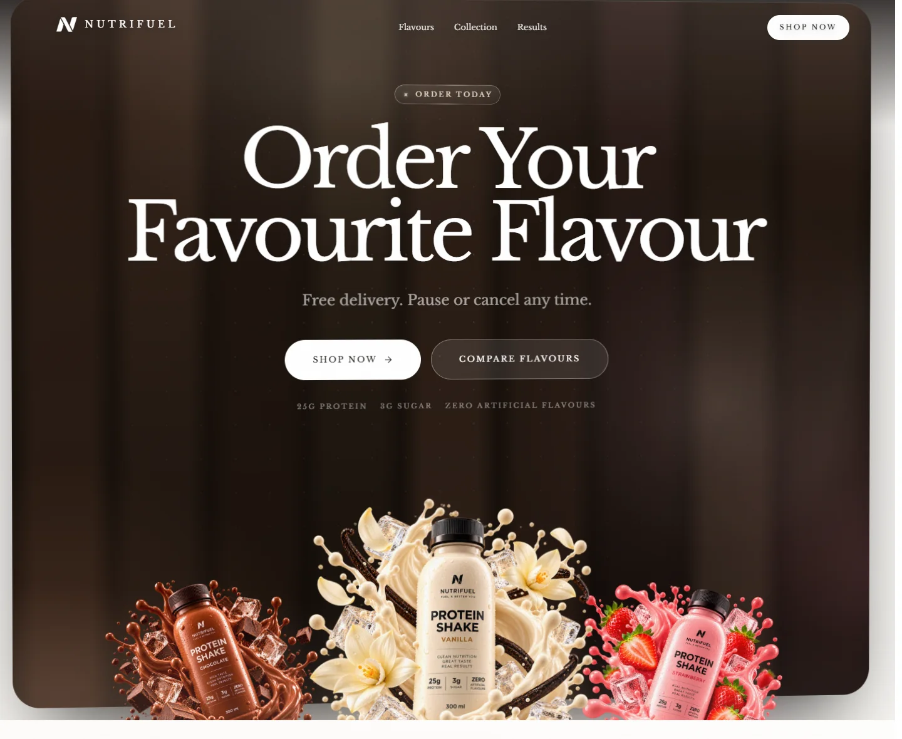
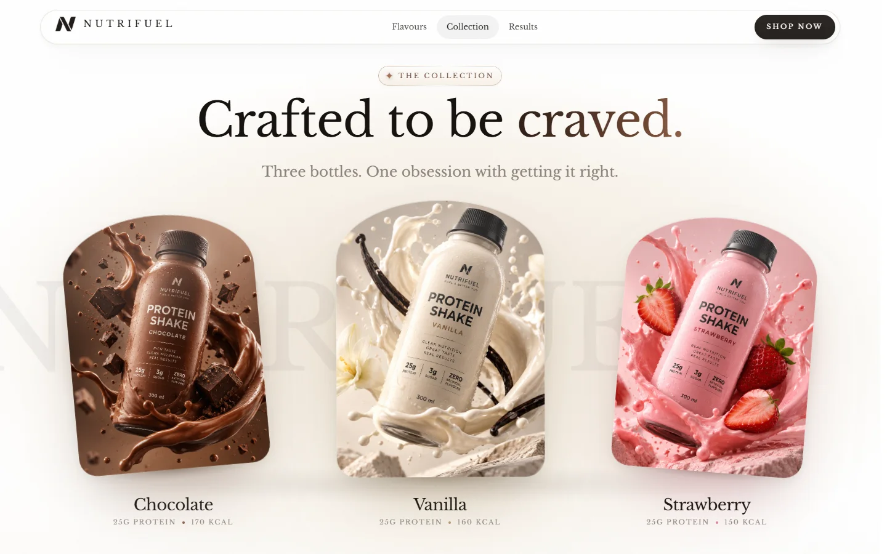

# NutriFuel

**Fuel a better you.** A single-page landing site for a ready-to-drink protein shake brand, built around scroll-driven motion with Next.js, GSAP and Lenis.



The shakes come in Chocolate, Vanilla and Strawberry, each with 25g of complete protein, 3g of sugar and no artificial flavours. The page tells one continuous story as you scroll: a looping hero film, two pinned scroll scenes and an order panel that responds to the cursor. It is built to stay usable with a keyboard, a screen reader and reduced motion turned on.

## Highlights

- **Scroll-scrubbed storytelling:** GSAP ScrollTrigger timelines and two pinned scenes, with Lenis smooth scrolling running on the same animation loop.
- **A restrained visual language:** one serif typeface, a warm token-based palette, a faint grain texture and soft page light.
- **Cursor effects built to be cheap:** every cursor-following effect shares a single `pointermove` listener. They switch off on touch screens and under reduced motion.
- **Data-driven content:** flavours, testimonials, links and media live in typed data files, so you can change them without touching the layout.
- **Accessible by default:** a skip link, labelled sections, screen-reader-friendly heading reveals, and a finished static layout for every scroll scene under reduced motion.

### Page tour

- **Loading screen:** the logo appears while a dumbbell, a shaker and a kettlebell draw themselves on. The shaker fills with cocoa as the percentage counts up, then the screen lifts away like a curtain.
- **Navigation:** a floating pill. Over the dark hero and order stages it shows bare white type with a soft shadow, and elsewhere it becomes frosted white glass. On desktop, a marker glides to the link for the section in view. On smaller screens, a full-screen menu wipes down with large numbered links.
- **Hero (`#top`):** a full-width looping film of all three bottles. It settles in from a slight zoom, drifts with a scroll-scrubbed parallax and pauses when off screen.
- **Flavours (`#flavours`):** three cards fly forward as one stacked deck, then split into a row on a pinned, scroll-scrubbed stage. On hover, each card turns like a solid object while the background washes in its flavour colour. On phones the cards become a swipe carousel.
- **Protein dial (`#protein`):** a 25g dial on a cocoa band. The arc draws clockwise, each tick lights as the counter climbs, and the whole disc tilts in 3D as it scrolls past.
- **Collection (`#showcase`):** a pinned scene staged like a product film. The vanilla bottle stands alone, then chocolate and strawberry fan out from behind it, a giant NUTRIFUEL wordmark drifts past and "Crafted to be craved." resolves. The centre bottle tilts towards the cursor with a glassy sheen.



- **Results (`#results`):** three figures count up. Below them, two rails of testimonial cards glide in opposite directions, moving only while you scroll.
- **Order (`#order`):** a dark slab arrives leaned back and scrubs flat while its copy settles onto it. Inside, warm gradient bands and pools of flavour light drift, and three transparent bottle cut-outs rise into place along the bottom edge. On a fine pointer:
  - the slab leans towards the cursor;
  - a lamp follows the cursor and changes colour by flavour;
  - the edges catch the light;
  - the two buttons pull gently towards the cursor.
- **Footer:** a cocoa wordmark wipes in as the footer comes into view, and two shaker drawings either side fill as you scroll down and empty again on the way back up.
- **Small details throughout:** section eyebrows are chips with a twinkling star and a passing glint. Headings hinge, wipe or rise into view, and counters rise out of a mask.

## Tech stack

| Library | Version | Role here |
| --- | --- | --- |
| [Next.js](https://nextjs.org) (App Router) | 15.5.23 | Single route, metadata, `next/font` and `next/image` optimisation |
| [React](https://react.dev) | 19.2.8 | UI |
| [TypeScript](https://www.typescriptlang.org) | 5.9.3 | Strict mode, `@/*` path alias to `src/*` |
| [Tailwind CSS](https://tailwindcss.com) | 4.3.3 | CSS-first set-up: tokens and custom utilities in `globals.css`, no `tailwind.config` |
| [GSAP](https://gsap.com) + ScrollTrigger | 3.15.0 | Every scroll-linked timeline and pinned scene, and most entrances and idle loops |
| [Lenis](https://lenis.darkroom.engineering) | 1.3.26 | Smooth scrolling, driven from the GSAP ticker |
| [Motion](https://motion.dev) | 12.43.0 | The mobile menu overlay only |
| [lucide-react](https://lucide.dev) | 1.33.0 | Icons |
| Radix Slot + class-variance-authority | 1.3.3 / 0.7.1 | The polymorphic button and its variants |
| clsx + tailwind-merge | 2.1.1 / 3.6.0 | `cn()` class merging, extended with the custom tokens |
| Libre Baskerville | via `next/font` | The single typeface |

The versions listed are the ones pinned in `package-lock.json`.

## Getting started

### Prerequisites

- **Node.js 20 or newer** and npm. Tailwind CSS v4's native engine requires Node 20.
- **Internet access on the first run.** `next/font` downloads Libre Baskerville during development and build.
- **No environment variables are required.** The app reads none; `next.config.ts` only checks two optional build flags, described under Scripts.

### Install and run

Clone the repository, then from its folder:

```bash
npm ci
npm run dev
```

Then open [http://localhost:3000](http://localhost:3000). `npm ci` installs the exact dependency tree recorded in `package-lock.json`.

### Scripts

| Command | What it does |
| --- | --- |
| `npm run dev` | Starts the development server at `localhost:3000` |
| `npm run typecheck` | Runs a strict TypeScript check (`tsc --noEmit`) |
| `npm run build` | Creates the production build |
| `npm run start` | Serves the production build (run `build` first) |

A few notes:

- **Build and dev server:** both write to `.next` by default, so stop the dev server before running `npm run build`. To build alongside a running dev server instead, set `QA_BUILD=1` (output goes to `.next-qa`) or `QA_DIR=<folder>`, and pass the same flag to `npm run start`.
- **Linting:** ESLint is not set up in this repository yet, so `npm run lint` opens the interactive ESLint set-up from Next.js instead of linting the code. (`next lint` is also deprecated in Next.js 15.5.)
- **Tests:** there is no test suite.

## Project structure

```
src/
├── app/
│   ├── layout.tsx       Font, metadata, skip link, smooth scroll, loader, nav, footer
│   ├── page.tsx         The six page sections, in order
│   ├── globals.css      Tailwind theme tokens, custom utilities, base styles
│   └── icon.png         Favicon
├── components/
│   ├── layout/          Page chrome: Loader, Nav, SmoothScroll (Lenis), Grain
│   ├── sections/        Hero, Flavours, ProteinStat, Showcase, Results, FinalCta, Footer
│   ├── motion/          Reusable primitives: SplitHeading, Counter, Float, Ambient,
│   │                    GradientLoop, Magnetic, Tilt
│   ├── media/           BackgroundVideo, BottleImage
│   └── ui/              Button, Logo, Eyebrow, SectionIntro, brand icons, line illustrations
├── hooks/               useGsap, useIsoLayoutEffect, useMediaQuery (reduced motion, fine pointer)
└── lib/
    ├── site.ts          Brand, navigation, store and social links
    ├── flavours.ts      The three flavours: copy, nutrition, colours, images
    ├── content.ts       Testimonials and results figures
    ├── media.ts         Asset manifest: paths, dimensions, focus points, blur placeholders
    ├── gsap.ts          One-time GSAP and ScrollTrigger set-up
    ├── pointer.ts       Shared pointer store for cursor effects
    ├── loading.ts       Hand-off from the loading screen to the page
    ├── split.ts         Accessible text splitter for heading reveals
    ├── ease.ts          Easing curves shared with the CSS
    └── utils.ts         cn() class helper

public/                  Hero film, bottle photographs, order cut-outs, logo
docs/                    README preview images
```

## How it works

### Design system

- **Tokens:** everything is defined in the `@theme` block of `src/app/globals.css`:
  - a warm palette (canvas, cream, sand, ink, cocoa, night, and vanilla and berry tones);
  - a type scale from `micro` to `mega` (fixed `micro` and `label` sizes, fluid `clamp()` sizes from `body` up), with its own line heights and tracking;
  - spacing and radii;
  - warm-tinted shadows;
  - three easing curves.
- **Custom utilities:** these are defined with Tailwind v4's `@utility`: `shell`, `glass`, `glass-dark`, `card-surface`, `eyebrow-chip`, `text-cocoa-gradient`, `reveal` and others.
- **Class merging:** `cn()` registers the custom font sizes, colours, shadows and tracking with `tailwind-merge`, so that classes like `text-ink` and `text-label` do not cancel each other out. When you add a token, add it there too.
- **Typeface:** Libre Baskerville only (400 and 700, normal and italic). Both `--font-display` and `--font-sans` resolve to it, and synthetic bold is switched off.
- **Flavour colours:** each flavour carries its own tone (accent, deep, soft, glow) as inline custom properties. These colours are only ever used as accents.
- **Logo:** `logo-mark.png` is painted as a CSS mask filled with `currentColor`, so the same file renders white in the nav over the dark stages and ink everywhere else.

### Motion architecture

- **One set-up point.** `src/lib/gsap.ts` registers ScrollTrigger once on the client and sets shared defaults. It also removes `resize` from ScrollTrigger's automatic refresh events, so a collapsing mobile address bar never re-measures the page; the Flavours section triggers a refresh itself when the width changes. Every component imports GSAP from here.
- **One animation loop.** Lenis runs on `gsap.ticker` and reports each scroll to ScrollTrigger, so smooth scrolling and scroll-linked animation share a single frame loop. In-page anchor links glide over 1.2 seconds. The `useSmoothScroll()` hook exposes `scrollTo`, `stop` and `start`.
- **Clean-up by default.** `useGsap(setup, deps, scope)` runs its setup inside a `gsap.context` and reverts it when the component unmounts or its dependencies change. Tweens, ScrollTriggers and inline styles therefore never pile up, including under React Strict Mode.
- **Responsive choreography.** `gsap.matchMedia` picks a configuration for each breakpoint:
  - Flavours pins only on screens at least 48rem wide and 34rem tall, and plays unpinned everywhere else.
  - Showcase pins at every width, with a shorter pin on phones.
- **Loader hand-off.** `lib/loading.ts` lets the hero and nav entrances wait until the loading screen starts to lift.
- **One pointer store.** `lib/pointer.ts` attaches a single passive `pointermove` listener, and only while something is subscribed. On each animation frame it runs every subscriber's `measure()` first and then every `apply()`, so layout is read at most once per frame. Touch input is ignored. The subscribers are the magnetic buttons, the Showcase tilt, the order panel light rig and the footer drawings.
- **Heading reveals without plugins.** `lib/split.ts` splits text into words, characters and line masks in one pass. It keeps the original text in `aria-label` and hides the spans from assistive technology. `SplitHeading` offers five modes (`chars-blur`, `words-flip`, `lines-rise`, `chars-scatter`, `mask-wipe`), waits for fonts to load and reverts to plain text once the reveal has played.
- **Motion, used once.** The Motion library drives only the mobile menu. `lib/ease.ts` mirrors the two CSS easing curves it uses (`luxe` and `curtain`), so both systems move alike.

### Content and media

- **Content:** `lib/site.ts` holds the brand, navigation and links. `lib/flavours.ts` holds the three flavours, and `lib/content.ts` holds the testimonials and results figures. Section headings and some short lines of copy sit in their section components.
- **Media manifest:** `lib/media.ts` lists every media asset: the hero film path, the dimensions of each image and, for the three bottle photographs, a measured focus point and an inline blur placeholder.
- **Image quality:** the photographs and cut-outs go through `next/image` in AVIF or WebP. `next.config.ts` allows only quality values of 75 or 90.
- **Swapping an image:** the image optimiser caches each URL for 30 days, so give new artwork a **new filename**, then update its path and dimensions in `lib/media.ts`. For the bottle photographs, also re-measure the focus point and blur placeholder, and keep every frame at or below 4:5 (`MAX_FRAME_ASPECT`) so the type printed on the photographs stays out of shot.

## Accessibility

- **Page structure:** the page has `lang="en"`, a "Skip to content" link and a clear focus ring on every interactive element.
- **Section labels:** every section is labelled by its heading. The hero and protein headings are screen-reader only, because those sections are visual.
- **Mobile menu:** the toggle exposes `aria-expanded` and `aria-controls`. Opening the menu moves focus into it, Escape closes it and focus returns to the toggle. The active desktop link carries `aria-current`.
- **Decorative layers:** the video, grain, drawings, the duplicate testimonial rail and the reverse face of each flavour card are hidden from assistive technology.
- **Keyboard on flavour cards:** focusing a card cancels its hover turn. If the cards have not arrived yet, the pinned scene scrolls to where they are visible.
- **Loading screen:** it is announced politely as a status, and is hidden entirely when JavaScript is off.

### Reduced motion

When `prefers-reduced-motion: reduce` is set:

- the loading screen is dismissed as soon as the page loads and Lenis is switched off, so the browser's native scroll is used;
- scroll timelines and idle loops do not run, and pinned scenes show their finished composition;
- the hero film does not play;
- the Results rails become a native, snapping horizontal scroller;
- counters show their final values, and cursor effects and the card turn are switched off;
- anything a timeline would fade in stays visible, and CSS animations and transitions are cut to near zero.

## Performance

- **Images:** the bottle photographs and order cut-outs go through `next/image` with AVIF and WebP output and lazy loading, and the photographs also carry blur placeholders. The logo is a small PNG used as a CSS mask.
- **Hero film:** it is muted, loops and plays inline, and only while on screen. MP4 files are served with a 30-day cache header.
- **Paused loops:** the gradient bands and flavour-light loops inside the order panel pause whenever the panel is off screen.
- **Rendering choices:**
  - ambient layers animate transform and opacity instead of blur filters;
  - the grain uses normal blending, so the viewport is not re-blended on every scroll frame;
  - card hover shadows are pre-rendered layers that crossfade;
  - the Flavours background wash is driven by a data attribute rather than React state.
- **Smaller bundles:** `lucide-react` and `motion` are listed in `optimizePackageImports`.

## Before launch

These values are placeholders and need replacing before the site goes live:

- **Storefront:** `STORE_URL` in `src/lib/site.ts` (currently `https://nutrifuel.example/shop`) is where the order section's Shop Now button points. Every other shop button (nav, mobile menu, hero and the flavour cards) scrolls to `#order`.
- **Site URL and email:** `SITE.url` and `SITE.email` use the reserved `nutrifuel.example` domain (the email is not shown on the page yet). `SITE.url` is also the `metadataBase`, so Open Graph and Twitter images resolve against it.
- **Social links:** `SOCIALS` currently points at the Instagram, YouTube and Facebook home pages.
- **Testimonials and figures:** the reviews, names and figures in `src/lib/content.ts` are illustrative, and every testimonial card shows a fixed five-star rating set in `src/components/sections/Results.tsx`. Replace them with real reviews and verified numbers.
- **Product claims:** check the nutrition figures in `src/lib/flavours.ts` and `src/lib/site.ts` against the final label. The same claims also appear in `src/components/sections/ProteinStat.tsx`, `FinalCta.tsx` and `Flavours.tsx`, and the order panel's "Free delivery. Pause or cancel any time." line in `FinalCta.tsx` needs confirming too.
- **Share image:** the social share image is `/vanilla.png`, set in `src/app/layout.tsx`.

## Licence

No licence has been granted for this repository, so all rights are reserved. The code is shared for reference only. The NutriFuel name, logo, photography and film are not licensed for reuse.

## Credits

Designed and developed by [Mahir Jambhule](https://github.com/Mahirjambhule).
